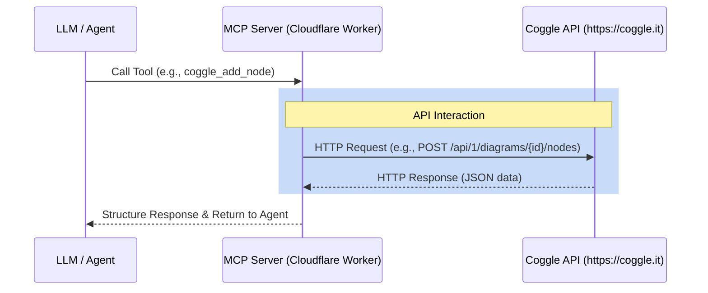

# Coggle API Technical Manual

## 1. Overview
This document details the internal logic and component details of the Coggle API integration within the Model Context Protocol (MCP) server. The integration is exposed as an MCP provider designed to run in a Cloudflare Workers environment using Server-Sent Events (SSE).

## 2. Authentication
The API utilizes Bearer Token authentication. All requests to the Coggle API must include an `Authorization` header with a valid API token.

- **Header Format**: `Authorization: Bearer <token>`
- **Content-Type**: `application/json` (for POST/PUT requests)
- **Accept**: `application/json`

## 3. Architecture & Data Flow

## 4. MCP Tools & Endpoints

### 4.1. coggle_list_diagrams
- **Description**: Retrieve a list of diagrams belonging to the user.
- **Endpoint**: `/api/1/diagrams`
- **Method**: `GET`
- **Parameters**: None

### 4.2. coggle_get_diagram
- **Description**: Retrieve the complete list of nodes and content structure of a specific diagram by its ID.
- **Endpoint**: `/api/1/diagrams/{diagram_id}/nodes`
- **Method**: `GET`
- **Parameters**: 
  - `diagram_id` (string): The unique identifier of the diagram to retrieve.

### 4.3. coggle_create_diagram
- **Description**: Create a new Coggle diagram.
- **Endpoint**: `/api/1/diagrams`
- **Method**: `POST`
- **Parameters**: 
  - `title` (string): The title of the new diagram.

### 4.4. coggle_add_node
- **Description**: Add a new node to a diagram.
- **Endpoint**: `/api/1/diagrams/{diagram_id}/nodes`
- **Method**: `POST`
- **Parameters**: 
  - `diagram_id` (string): The ID of the diagram.
  - `parent` (string): The ID of the parent node to attach the new node to.
  - `text` (string): The text content of the new node.
  - `offset_x` (number, optional): Optional horizontal offset from the parent node (positive is right).
  - `offset_y` (number, optional): Optional vertical offset from the parent node (positive is down).

### 4.5. coggle_update_node
- **Description**: Modify an existing node in a diagram.
- **Endpoint**: `/api/1/diagrams/{diagram_id}/nodes/{node_id}`
- **Method**: `PUT`
- **Parameters**: 
  - `diagram_id` (string): The ID of the diagram.
  - `node_id` (string): The ID of the node to update.
  - `text` (string, optional): The new text content for the node.
  - `parent` (string, optional): The ID of a new parent node.
  - `offset_x` (number, optional): Optional new horizontal offset.
  - `offset_y` (number, optional): Optional new vertical offset.

### 4.6. coggle_delete_node
- **Description**: Remove a node and all its descendants from a diagram.
- **Endpoint**: `/api/1/diagrams/{diagram_id}/nodes/{node_id}`
- **Method**: `DELETE`
- **Parameters**: 
  - `diagram_id` (string): The ID of the diagram.
  - `node_id` (string): The ID of the node to delete.

## 📝 Version History

| Version | Date | Description | Author |
|---------|------|-------------|--------|
| 1.0.0 | 2026-02-20 | Initial documentation of the Coggle API integration endpoints. | Documentation Specialist |
